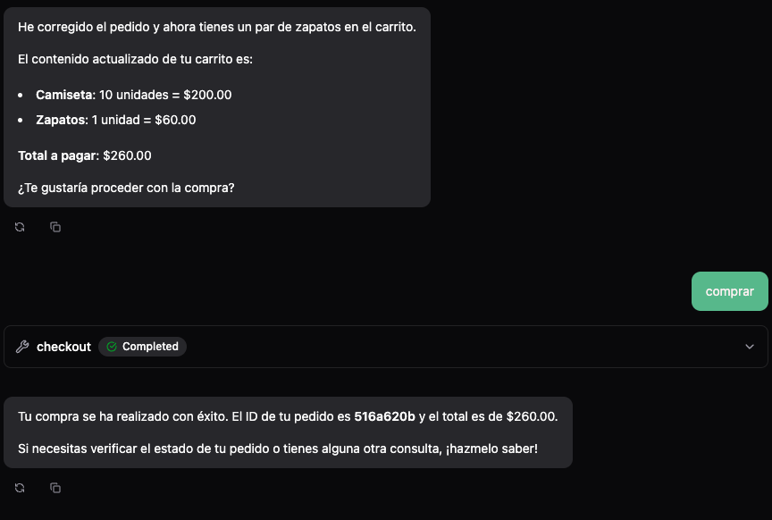
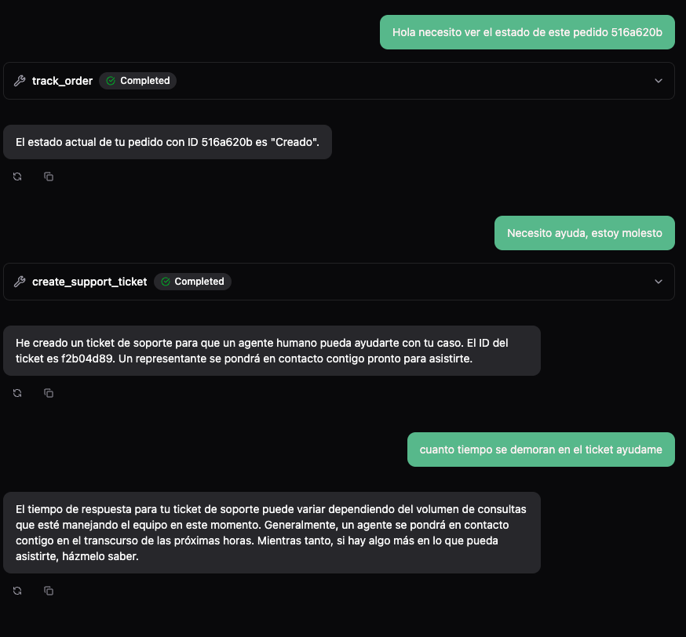

# Sales AI - Asistente de Ventas Inteligente

## 📄 Descripción General

Sales AI es un asistente virtual diseñado para la tienda "Makro", capaz de guiar a los clientes a través de todo el ciclo de compra de manera natural y conversacional.

El sistema permite:
1.  **Consultar Productos**: Ver catálogo, precios y detalles.
2.  **Gestionar Carrito**: Agregar y quitar productos (con validación de stock en tiempo real).
3.  **Realizar Pedidos**: Checkout y generación de órdenes de compra.
4.  **Seguimiento**: Consultar el estado de un pedido (Creado, En Proceso, Enviado).
5.  **Soporte (feature extra)**: Escalar casos complejos o clientes molestos a un agente humano mediante tickets.

Característica clave: **Honestidad y Validación**. El agente nunca promete stock inexistente ni ofertas falsas, y si detecta frustración del usuario, escala el caso automáticamente.

---

## 📸 Ejemplos de Uso

### Proceso de Compra


### Escalado a Soporte (Cliente Molesto)


---

## 🏗 Arquitectura Propuesta

El proyecto sigue una arquitectura **modular y desacoplada**, diseñada para ser escalable y fácil de mantener.

```
sales-ai/
├── main.py                  # Punto de entrada (Servidor Web)
├── Dockerfile               # Configuración para contenedorización
├── src/
│   ├── models/
│   │   └── schemas.py       # Modelos de Datos (Product, CartItem, Order, Ticket)
│   ├── services/
│   │   └── store.py         # Lógica de Negocio y Estado (In-Memory Database)
│   ├── tools/               # Herramientas del Agente (Separación de responsabilidades)
│   │   ├── products.py      # Gestión de Catálogo y Carrito
│   │   ├── orders.py        # Checkout y Tracking
│   │   └── support.py       # Escalado y Tickets
│   └── agent/
│       └── sales_agent.py   # Configuración del Agente y Prompt del Sistema
```

### Componentes Clave:
-   **Agent Layer (`src/agent`)**: Define al agente de IA, su personalidad y las herramientas disponibles.
-   **Service Layer (`src/services`)**: Centraliza la lógica de negocio y el acceso a datos. Implementa el patrón Singleton (`store`) para simular una base de datos persistente en memoria.
-   **Tool Layer (`src/tools`)**: Funciones puras que el agente puede invocar. Actúan como puente entre el lenguaje natural y la capa de servicios.
-   **Data Layer (`src/models`)**: Definiciones claras de las entidades del dominio usando `dataclasses`.

---

## 🛠 Tecnologías Utilizadas

-   **Lenguaje**: [Python 3.13](https://www.python.org/)
-   **IA Framework**: [Pydantic AI](https://ai.pydantic.dev/) (para estructuración robusta de agentes).
-   **LLM**: OpenAI GPT-4o.
-   **Gestión de Dependencias**: [uv](https://github.com/astral-sh/uv) (extremadamente rápido).
-   **Validación de Datos**: [Pydantic](https://docs.pydantic.dev/).
-   **Contenedorización**: Docker & Docker Compose.
-   **Logs**: Logfire (para observabilidad).

---

## 🔄 Flujo de Conversación

1.  **Entrada del Usuario**: El cliente envía un mensaje (ej. "Quiero 2 camisetas").
2.  **Análisis de Intención**: El Agente (GPT-4o) analiza el mensaje basándose en su *System Prompt*.
3.  **Selección de Herramienta**:
    -   Si pide ver productos -> `list_products`.
    -   Si quiere comprar -> `add_to_cart`.
    -   Si está molesto -> `create_support_ticket`.
4.  **Ejecución (Service Layer)**: La herramienta interactúa con `StoreService`.
    -   *Ejemplo*: `add_to_cart` verifica `product.stock > requested_quantity`.
5.  **Respuesta**:
    -   Si hay éxito: El agente confirma la acción y muestra el estado actual (ej. resumen del carrito).
    -   Si hay error (ej. sin stock): El agente informa la limitación honestamente y sugiere alternativas.

---

## 🚀 Instrucciones de Ejecución

### Prerrequisitos
-   Tener una **OpenAI API Key**.
-   Instalar [uv](https://github.com/astral-sh/uv) o Docker.

### Configuración
1.  Clona el repositorio.
2.  Crea el archivo `.env`:
    ```bash
    cp .env.example .env
    ```
3.  Agrega tu API Key en `.env`: `OPENAI_API_KEY=sk-...`
4.  **(Opcional)** Logfire para observabilidad:
    Está deshabilitado por defecto para no hacer tan compleja la instalacion del proyecto. Para acceder a los logs y métricas:
    1.  Acepta la invitación enviada previamente por correo electrónico.
    2.  Ingresa a [Logfire - Logs](https://logfire-us.pydantic.dev/juliancape/sales-ai?last=%227d%22) para ver la actividad de los últimos 7 días.
    3.  Ingresa a [Logfire - Dashboard de Costos](https://logfire-us.pydantic.dev/juliancape/sales-ai/dashboards/standard/token-usage-records?start=7d&refresh=0s&var-resolution=3+hours) para ver el consumo de tokens.

### Docker
```bash
docker compose up --build
```
El servicio estará disponible en `http://localhost:8000`.

---

## 💡 Decisiones Técnicas Relevantes

1.  **Estado en Memoria (Singleton)**:
    -   Para reducir la complejidad de este MVP, se optó por un `StoreService` que mantiene los datos en memoria (`dicts`). En producción, esto se reemplazaría fácilmente por una conexión a SQL/NoSQL sin cambiar el resto del código (gracias a la inyección de dependencias en las *tools*).

2.  **Separación Agente vs. Lógica**:
    -   El agente **NO** accede a los datos directamente. Siempre usa *herramientas*. Esto desacopla la inteligencia (LLM) de la infraestructura de datos.

3.  **Validación de Stock Estricta**:
    -   Se implementó una regla de negocio dura: el agente no puede alucinar stock. La herramienta `add_to_cart` falla programáticamente si no hay inventario, forzando al LLM a comunicar el error real.

4.  **Prevención de Spam en Tickets**:
    -   Para evitar que un usuario molesto genere miles de tickets, se implementó un *rate limiting* lógico: si ya existe un ticket creado hace menos de 5 minutos, el sistema rechaza la creación de uno nuevo.

5.  **Pydantic AI**:
    -   Se eligió sobre LangChain por su simplicidad, tipado fuerte y enfoque "Pythonic".

---

## Próximos Pasos (Roadmap)

Para evolucionar este MVP hacia un producto de producción robusto, se consideran las siguientes mejoras:

1.  **RAG (Retrieval-Augmented Generation)**:
    -   Implementar una base de conocimientos vectorial para que el agente pueda responder preguntas sobre políticas de devolución, envíos y detalles técnicos de productos sin depender únicamente del prompt del sistema.

2.  **Evaluación Continua (Pydantic Evals)**:
    -   Integrar un pipeline de evaluación automática para medir la precisión y calidad de las respuestas del agente ante cambios en el código o en los prompts.

3.  **Optimización Automática de Prompts (GEPA)**:
    -   Implementar *Generative Evolutionary Prompt Optimization* para refinar dinámicamente las instrucciones del sistema basándose en métricas de éxito reales, mejorando la conversión de ventas y la satisfacción del cliente de forma autónoma.

---

## Documentación para profundizar

Para profundizar en los conceptos de Agentes y Optimización aplicados en este proyecto:

-   [Building an Agentic Application (Pydantic AI)](https://pydantic.dev/articles/building-agentic-application)
-   [Prompt Optimization with GEPA](https://pydantic.dev/articles/prompt-optimization-with-gepa)